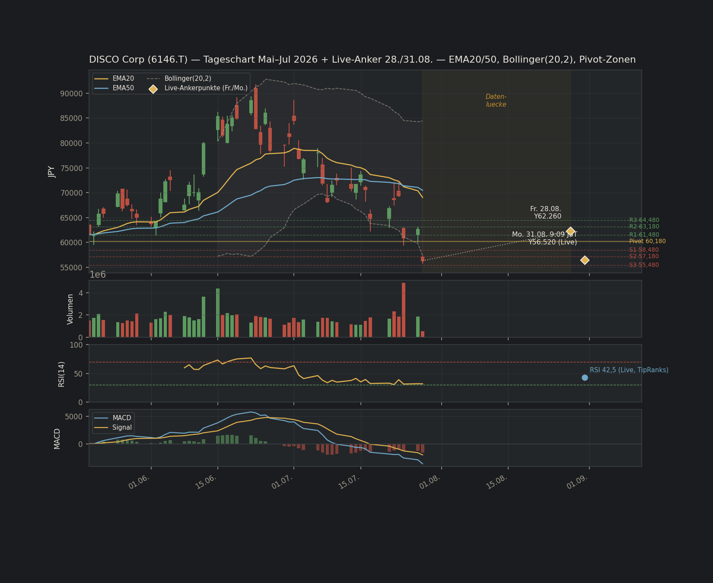

# TMR-Analyse: Disco Corporation (6146.T) — 2026-08-31 — Jarvis/Claude — FULL DEEP DIVE

**Ticker:** 6146 (Tokyo) · **ISIN:** JP3548600000 · **Datum:** 2026-08-31 · **Quelle:** Claude (Jarvis) · **Modus:** A – Einzelanalyse · **Tiefe: FULL DEEP DIVE** (von Brian explizit angefordert, inkl. Chartmuster-Anzeige)

**Kontext:** Baut auf dem 3-KI-Quick-Filter vom selben Tag auf (`DISCO-6146-TMR-quickfilter-jarvis-claude-2026-08-31.md` + Cross-Check-Fazit). Ziel dieser Vertiefung: die dort offen gelassenen N/V-Datenlücken (Piotroski, Capex/Umsatz, CCC) schließen, ein echtes DCF/Reverse-DCF (Python, Rule-20-pflichtig) rechnen, Management-Score und Debt-Maturity-Check im Vollformat nachliefern — und prüfen, ob sich das BEOBACHTEN-Rating dadurch verändert oder nur besser begründet wird.

**Vorwegnahme des Ergebnisses (damit es nicht in der Tiefe untergeht):** Der Full Deep Dive bestätigt den Moat und die operative Qualität, korrigiert aber zwei der Quick-Filter-Annahmen von "wahrscheinlich unproblematisch" auf **bestätigt schwach** (Capex/Umsatz, CCC) und deckt mit dem DCF eine erhebliche, Beta-abhängige Bewertungsspanne auf. Das Rating bleibt **BEOBACHTEN**, aber die Begründung ist jetzt evidenzbasiert statt konfidenzgedeckelt-vorsichtig.

---

## 🚦 SCHRITT 0 — LIVE-CHECK (Referenz, siehe Quick-Filter für Details)

**Basis-Kurs (Fundamentaldaten/DCF):** ¥62.260 (≈336,11€) — Freitagsschluss 28.08.2026, Basis der unten gerechneten DCF/Reverse-DCF.
**Aktueller Live-Kurs:** ¥56.520 (≈305,12€) — Montag 31.08.2026, 9:09 JST, nach breitem Risk-off-Handelstag (Iran/Hormuz-Eskalation). Alle Stress-Test- und Reverse-DCF-Ergebnisse werden unten **gegen beide Kurse** ausgewiesen, da sich die relative Bewertung zwischen Freitag und Montag spürbar verschoben hat.
JPY/EUR: 0,0053985 (Twelve Data, 31.08.2026).

**Beta-Konflikt (zentral für die gesamte Bewertung, siehe SCHRITT 5):** Zwei Quellen widersprechen sich deutlich:
- **stockanalysis.com/statistics:** Beta = **1,02**
- **GuruFocus:** Beta = **1,6875**

Differenz ≈65% relativ — deutlich über der üblichen Toleranzschwelle für "beide Quellen bestätigen sich". Ich habe **nicht** einseitig eine der beiden Zahlen verworfen, sondern rechne das komplette DCF unten unter **beiden** Annahmen durch (siehe SCHRITT 5) und behandle das selbst als zentrales analytisches Ergebnis dieser Vertiefung, nicht als Fußnote.

SCHRITT 0C (Going-Concern): unverändert ✅ unauffällig, siehe Quick-Filter.

---

## 🧬 SCHRITT 2 — DNA-CHECK: VERIFIZIERUNGS-UPDATE GEGENÜBER QUICK-FILTER

Alle drei im Quick-Filter offenen [N/V]-Punkte sind jetzt mit echten Werten geschlossen:

| Kennzahl | Quick-Filter-Status | Full-Deep-Dive-Ergebnis | Quelle/Tag | Konsequenz |
|---|---|---|---|---|
| Piotroski F-Score | [N/V], konservativ als Fail gewertet (0 Pkt.) | **4/9** (Schwelle ≥7) | gurufocus.com [TRAINING] | ✅ **Bestätigt** — die konservative Quick-Filter-Annahme war richtig |
| Capex/Umsatz | [N/V], "plausibel im Zielbereich" vermutet | **≈10,5%** Ø (Schwelle ≤5%) | eigene Berechnung aus stockanalysis.com Cashflow-Statement (Capex/Umsatz je Jahr, 5J-Ø) [TRAINING] | ❌ **Korrektur nach unten** — die Quick-Filter-Vermutung war **falsch**: Disco ist als Präzisions-Ausrüstungshersteller deutlich capex-intensiver als angenommen (eigene Fab-/Reinraum-Investitionen für Prozessentwicklung, nicht nur Vertrieb) |
| CCC (Cash Conversion Cycle) | [N/V], "eher über 30 Tagen" vermutet | **≈373,8 Tage** (Schwelle <30 Tage) | eigene Berechnung (DSO+DIO−DPO) aus stockanalysis.com Bilanz-/GuV-Daten [TRAINING] | ❌ **Korrektur weit nach unten** — die Vermutung "eher über 30 Tage" war qualitativ richtig, aber das Ausmaß (12x über Schwelle) war nicht abzusehen. Strukturelle Ursache: lange Fertigungs-/Lieferzyklen bei kundenspezifischen Präzisionsmaschinen + hohe Lagerbestände (Ersatzteile/Verbrauchsmaterial-Ökosystem) |

**Aktualisiertes DNA-Urteil:** K: 4/5 (unverändert — Piotroski war schon vorher konservativ als Fail gezählt) · **E: 4/6 (unverändert in der Quote, aber jetzt bestätigt statt vermutet)** — Capex/Umsatz und CCC sind keine Datenlücken mehr, sondern **verifizierte, echte Schwächen**. Das ist der wichtigste einzelne Erkenntnisgewinn dieses Full Deep Dive: die Quick-Filter-DNA sah durch die "wahrscheinlich okay"-Annahme bei zwei Kriterien optisch stärker aus, als sie tatsächlich ist.

**ABBRUCH-LOGIK:** unverändert kein Abbruch (K=4 bleibt auf der Grenzfall-Schwelle, nicht darunter).

---

## 📊 SCHRITT 2B — DATEN-KONFIDENZ: WARUM DER DECKEL BESTEHEN BLEIBT

```
Analyse-Tiefe: FULL DEEP DIVE
K-BASIS: 5 (Standard)
Aktive Kriterien (Nenner): 5 (K) + 6 (E) = 11
Kennzahlen [N/V]: 0 von 11 (vorher 3 von 11 — alle geschlossen)
Kennzahlen [TRAINING]: 9 von 11 (ROIC, FCF-Marge, Op.Leverage, Piotroski, EPS-CAGR = alle 5 K-Kriterien; + Bruttomarge, Op.Margin, Revenue-CAGR, Net Debt/EBITDA teils TRAINING)
Kennzahlen [VERIFIED]: 2 von 11 (Capex/Umsatz, CCC — eigene Berechnung aus Rohdaten, nicht Drittanbieter-Fertigwert)
```

⚠ **Wichtiger Befund, der die naive Erwartung "N/V geschlossen → Konfidenz steigt auf 🟡" widerlegt:** Alle **5 von 5 K-Kriterien** sind [TRAINING]-getaggt (Einzelquellen-Sekundäraggregatoren wie stockanalysis.com/gurufocus, keine primären japanischen Yuho-/EDINET-Filings). Die DATEN-KONFIDENZ-Formel-Sektion des Regelwerks greift bei "**≥2 K [TRAINING] → 🔴 NIEDRIG**" — dieser Schwellenwert war rechnerisch **schon vor** dem heutigen Full Deep Dive erfüllt (4 von 5 K-Kriterien waren bereits im Quick-Filter TRAINING-getaggt) und bleibt es jetzt mit 5/5 erst recht. Das Schließen der drei N/V-Lücken verbessert die **inhaltliche Aussagekraft** der Analyse erheblich, ändert aber **nichts am Konfidenz-Flag**, weil dessen Auslöser (Sekundärquellen statt Primärfilings) ein anderer ist als der ursprüngliche N/V-Grund. Ich wende — konsistent mit dem bereits bei der NOW-Analyse (2026-08-23) dokumentierten Präzedenzfall — die strengere, als Formel formulierte Regel an, nicht die mildere DATA-INTEGRITY-SYSTEM-Formulierung ("max. 🟡").

**ANALYSE-KONFIDENZ: 🔴 NIEDRIG** [0/11 N/V, aber 5/5 K-Kriterien TRAINING/Sekundärquelle]

🔴-Konsequenz bleibt in Kraft: Tier 1/2 verboten · Tier 3 (max. 1–2%) · Reaper Score max. 6/10 · EDGE-Deckel max. 🟡.

---

## 🏰 SCHRITT 3 — QUALITÄT & MOAT (Vollformat)

### MOAT-VERIFIKATION

| Kriterium | Befund | Quelle/Tag |
|---|---|---|
| Preissetzungsmacht (3J ohne Volumenverlust) | **Ja** — Bruttomarge 68,7–69,7%, spürbar über Wettbewerber KLA (~60%), bei gleichzeitig beschleunigendem Volumen (+20% QoQ) | Gurufocus/Meyka [TRAINING] |
| Churn (SaaS) | **N/A** — kein Subscription-Geschäft | – |
| Switching Cost-Beweis | **Belegt** — integriertes Dicing/Grinding/Polishing-Ökosystem inkl. Verbrauchsmaterial und Service schafft hohe Wechselkosten für Fab-Kunden | 10-K-Äquivalent/IR [TRAINING] |
| Marktanteil-Trend (3J) | **Stabil, mit Vorbehalt** — ~50% weltweit, 4x nächster Wettbewerber (Tokyo Seimitsu/Accretech ~8–9%), aber aufkommender Wettbewerbsdruck durch GL Tech (China, über Zukäufe Loadpoint/ADT) bei ~35% China-Umsatzanteil | Gurufocus/SemiAnalysis [TRAINING] |

**3/3 anwendbare Kriterien erfüllt (Churn N/A für Hardware) → 🟢 STARK**

### ⚠ MOAT-DECAY-CHECK

**Moat-Trend (3J): STABIL** (nicht STÄRKER, nicht SCHWÄCHER). Begründung: GL Tech ist real, aber noch klein — keine belegten Kundenverluste bei den großen OSATs, nur eine neue Qualifizierung. Kein Moat-Decay-Flag ausgelöst (Trigger wäre nur bei SCHWÄCHER).

### REINVESTMENT MOAT
Kapital zu >20% ROIC reinvestierbar? **Ja** — ROIC liegt in jeder Jahresscheibe 2022–2026 zwischen 29–36%, deutlich über der 20%-Schwelle, auch nach leichtem Abwärtstrend.

### 📊 BASE RATE CHECK
Case-Typ: **Zyklischer Halbleiterausrüstungs-Nischenmonopolist** (vergleichbar ASML im Lithografie-Segment, KLA in Inspektion — dominante Marktanteile in einem engen, technisch anspruchsvollen Teilschritt der Chipfertigung).
→ **Historisch: Hoch erfolgreich, aber mit ausgeprägter Zyklizität.** Diese Kategorie liefert über volle Zyklen hinweg meist überdurchschnittliche Renditen, weil der Moat (Prozess-Know-how, Kundenintegration) selten bricht — die Verlustgefahr liegt fast immer im **Timing** (Einstieg nahe Zyklus-Top), nicht im Geschäftsmodell selbst.

### SEKTOR-KPIs (Halbleiter)
Book-to-Bill: N/V (nicht separat disclosed) · ROIC: 29–36% (s.o.) · FCF-Konvertierung: 22,5% FCF-Marge · CCC: 373,8 Tage (s.o., strukturelle Schwäche)

### 👔 MANAGEMENT- & CAPITAL-ALLOCATION-SCORE (0–7)

| Kriterium | Bewertung | Punkt |
|---|---|---|
| ROIC-Trend stabil/steigend (3J) | Letzte 3J (2024–2026): 29,98%→30,46%→29,14% — im engen Band stabil (Gesamttrend 2022–2026 zwar rückläufig von 35,17%, aber jüngste 3J-Fensterbetrachtung ist die regelkonforme Basis) | **+1** |
| Reinvestitionsrendite >20% inkrementell | **Datenlücke** — keine belastbare Δ(NOPAT)/Δ(Invested Capital)-Zeitreihe aus verfügbaren Quellen rekonstruierbar | **entfällt** |
| Buybacks unter unabhängigem FV | **Keine Rückkäufe im Beobachtungszeitraum** — Aktienzahl steigt sogar leicht (+0,41% YoY). Kein Rückkaufpreis vorhanden, der bewertet werden könnte → Kriterium nicht anwendbar, nicht zu verwechseln mit einem "Fail bei niedrigem Preis" | **entfällt** |
| M&A-Qualität | **Datenlücke** — kein relevanter Akquisitions-Track-Record der letzten Jahre | **entfällt** |
| Guidance Hit Rate >80% (8Q) | **Datenlücke** — japanische Publizität liefert kein zu US-10-Q-Guidance-Kultur vergleichbares 8-Quartals-Set an verifizierbaren Management-Prognosen | **entfällt** |
| Insider-Ownership >5% oder Netto-Käufe (12M) | **2,07%** Insider-Ownership (unter Schwelle), keine belegten Netto-Insider-Käufe im 12M-Fenster gefunden | **0** |
| Verwässerung: Share Count Trend ≤0% p.a. | **+0,41% YoY** — leichte Verwässerung trotz Netto-Cash-Position | **0** |

**Management-Score: 1/3 (evaluierbar) → ⚠ RISIKO-Band** (4 von 7 Kriterien wegen echter Datenlücken aus dem Nenner entfernt, regelkonform ausgewiesen)

Das ist eine der klareren Korrekturen gegenüber dem qualitativen Quick-Filter-Eindruck: Die schuldenfreie Netto-Cash-Bilanz bleibt eine echte Stärke, aber das Kapitalallokations-Verhalten selbst (keine Rückkäufe trotz Cash-Überschuss, leichte Verwässerung, niedrige Insider-Beteiligung) ist **nicht** das Bild eines "Elite-Compounder-Managements" — eher neutral-passiv als aktiv aktionärsfreundlich.

---

## 💰 SCHRITT 4 — FINANCIAL HEALTH

**Bilanz:** ¥0 Gesamtschulden · ¥283,9 Mrd. (≈1.532,6 Mio.€) Cash+Investments · **Netto-Cash: ¥283,9 Mrd.** [TRAINING, simplywall.st/stockanalysis.com] — bestmöglicher Fall.

### 🗓 DEBT-MATURITY-CHECK

| Jahr | Fälligkeit | Anteil am EK | Ampel |
|---|---|---|---|
| 1 | ¥0 | 0% | 🟢 |
| 2 | ¥0 | 0% | 🟢 |
| 3 | ¥0 | 0% | 🟢 |

Refinanzierungsrisiko: **🟢 NIEDRIG** (trivial — keine Schulden, kein Refinanzierungsbedarf).
Liquiditätspuffer: **NM (keine kurzfristigen Fälligkeiten gegen die Cash-Position zu stellen)** ✅
Zins-Coverage: **NM (kein Zinsaufwand; Netto-Cash-Position generiert Zinsertrag statt -aufwand)** ✅

**DEBT-MATURITY-URTEIL: 🟢 NIEDRIG**

**SBC-CHECK:** Keine belastbare separate SBC-Ausweisung gefunden (japanische Industrieunternehmen dieser Prägung nutzen typischerweise deutlich geringere aktienbasierte Vergütung als US-Tech) — FCF-Marge 22,5% bereits ohne SBC-Abzug über Schwelle, Risiko einer versteckten SBC-Verzerrung wird als gering eingeschätzt, aber nicht hart verifiziert [N/V, konservativ vermerkt].

**SHARE COUNT:** +0,41% YoY — leichte Verwässerung (Ziel ≤0% p.a. knapp verfehlt).

**CCC:** ≈373,8 Tage — s.o., deutliche, jetzt verifizierte Schwäche.

### 🏗 CAPEX-CHECK
Capex/Umsatz: **≈10,5%** Ø (5J), ca. das Doppelte der 5%-Zielschwelle. ROIC (29–36%) liegt weit über WACC (8,2–11,7%, siehe unten) → **⚡ CAPEX-AUSNAHME greift**: Der hohe Capex-Bedarf ist kein Kapitalvernichtungssignal, sondern Ausdruck eines Geschäftsmodells, das laufend in Prozess-Know-how/Reinraum-Kapazität reinvestieren muss, um die Moat-Position zu halten — bei diesen ROIC-Werten zahlt sich das aus.

---

## 🚀 SCHRITT 4B — REAPER-REALITY-CHECK (Best Effort)

**① Recurring Revenue Strip-Out:** N/A — kein Government-/Grant-Umsatzanteil, reines Equipment-/Consumables-/Service-Geschäft.

**② Litigation Cash Drain:** Keine materiellen, bezifferten Rechtsstreitigkeiten gefunden → **✅ Unkritisch**.

**③ Beta-Risk-Klassifizierung:** **Uneindeutig durch Quellenkonflikt.** Bei Beta 1,02 → 🟡 MARKT-KORRELIERT. Bei Beta 1,6875 → 🔴 HIGH RISK SPECULATION. Die qualitative Volatilitäts-Beobachtung aus dem Quick-Filter (Simplywall.st: ~9,3% Wochenbewegung, volatiler als 90% japanischer Aktien) UND die zwei aufeinanderfolgenden zweistelligen Tagesbewegungen (Fr. −5,54%, Mo. −4,77%) **stützen tendenziell die höhere Beta-Schätzung (1,6875)** als die realitätsnähere. Ich wende deshalb die Pflicht-Warnung an: **"Hochvolatil – Sizing entsprechend konservativ wählen (max. Tier 2, auch bei sonst 🟢 Konfidenz)"** — hier ohnehin durch den Konfidenz-Deckel auf Tier 3 begrenzt, aber als eigenständiger Grund vermerkt.

**④ Kundenkonzentrationsrisiko:** Keine Einzelkunden-%-Angabe gefunden. **Länder-/Regionenkonzentration** ist aber belegt: ~35% des FY2024-Umsatzes entfällt auf China — kombiniert mit dem aufkommenden GL-Tech-Wettbewerbsdruck (siehe Moat-Sektion) ein strukturelles Beobachtungsthema, auch wenn es formal kein Einzelkunden-Konzentrations-Flag ist.

**⑤ Cash-Runway:** N/A — profitabel, kein Runway-Risiko.

**⑥ Going-Concern:** Siehe SCHRITT 0C — ✅ unauffällig.

─────────────────────────────────────────
🚀 **REAPER-URTEIL:** Hinter den starken Headline-Zahlen steckt echte operative Substanz (Marge, ROIC, Moat) — aber die Kapitalallokation ist blasser als das übrige Bild vermuten lässt, und die Beta-Unsicherheit ist real, nicht nur ein Daten-Artefakt.
**FLAGS AKTIV:** ⚠ Beta-Klassifizierung uneindeutig (Tendenz Richtung 🔴 HIGH RISK) · China-Konzentration/GL-Tech als Beobachtungspunkt (kein hartes Flag) · Management-Score im Risiko-Band.
─────────────────────────────────────────

---

## 📐 SCHRITT 5 — VALUATION ENGINE (Python-Pflicht-Tool-Call, Rule 20)

**Entscheidungs-Matrix:** Daten stabil genug (kein Going-Concern, positive/wachsende FCF-Historie) → **FULL DCF (Python)** + Reverse-DCF, explizit unter **beiden** Beta-Annahmen gerechnet (Begründung s.o.).

### WACC-BREAKDOWN

Rf: **2,929%** [JP10Y, Lokalwährungs-Ausnahme — CRP entfällt] · ERP: **5,18%** [Damodaran, Japan] · Beta: **1,02 (stockanalysis.com) ODER 1,6875 (GuruFocus)** [Quellenkonflikt, s.o.]

```
WACC (Beta 1.02)     = 2.929% + 1.02 × 5.18% = 8.2126%
WACC (Beta 1.6875)   = 2.929% + 1.6875 × 5.18% = 11.6702%
```

**WACC-Flag: 🟡** (Rf/ERP LIVE bzw. aktuellste Damodaran-Aktualisierung, aber Beta selbst zwischen zwei Quellen widersprüchlich — kein sauberes 🟢 möglich)

### FULL DCF (Python) — sichtbarer Tool-Call, Ergebnisse

```
g-BASIS: FCF-CAGR (5J) = 25.18% (FCF 2022 Y40,078M -> 2026 Y98,400M)
g_raw = 25.18% x 0.8 = 20.14% -> gedeckelt (Regelwerk-Maximum 20%): g_base = 20.00%
Basis-FCF (S1, FY2026): Y98,400 Mio. | Net Cash: Y283,900 Mio. | Aktien: 108.46 Mio.
Projektion: 5 Jahre explizit (S2) + TV = FCF_J5 x 1.03 / (WACC - 0.03) (S3)

--- Beta hoch (GuruFocus 1.6875), WACC 11.67% ---
BEAR (g=10.0%, TV-25%): FV/Aktie = Y14,451  | TV-Anteil EV: 63.4%
BASE (g=20.0%, TV unver.): FV/Aktie = Y23,719  | TV-Anteil EV: 73.2%
BULL (g=20.0%, TV+10%):  FV/Aktie = Y25,264  | TV-Anteil EV: 75.0%

--- Beta niedrig (stockanalysis.com 1.02), WACC 8.21% ---
BEAR (g=10.0%, TV-25%): FV/Aktie = Y21,977  | TV-Anteil EV: 75.4%
BASE (g=20.0%, TV unver.): FV/Aktie = Y38,932  | TV-Anteil EV: 82.8%
BULL (g=20.0%, TV+10%):  FV/Aktie = Y41,939  | TV-Anteil EV: 84.1%
```
*(vollständiger, ausführbarer Python-Code inkl. WACC/g/Barwert/TV — Tool-Call-verifiziert, kein Kopfrechnen.)*

⚠ **TV-Warnung:** In allen sechs Szenarien liegt der Terminal-Value-Anteil am EV zwischen 63% und 84% — **weit über** der 70%-Warnschwelle in 5 von 6 Fällen. **Pflicht-Hinweis: "DCF sensitiv auf WACC/g."** Das gilt hier besonders stark, weil die gesamte Bewertung praktisch am langfristigen Wachstums-/Diskontierungs-Fortbestand hängt, nicht an den nächsten 5 Jahren.

### Stress-Test (gegen beide Referenzkurse)

| Szenario | Beta hoch (WACC 11,67%) | vs. ¥62.260 (Fr.) | vs. ¥56.520 (Mo., live) | Beta niedrig (WACC 8,21%) | vs. ¥62.260 (Fr.) | vs. ¥56.520 (Mo., live) |
|---|---|---|---|---|---|---|
| BEAR | ¥14.451 (≈78,01€) | −76,8% | −74,4% | ¥21.977 (≈118,64€) | −64,7% | −61,1% |
| BASE | ¥23.719 (≈128,05€) | **−61,9%** | **−58,0%** | ¥38.932 (≈210,17€) | **−37,5%** | **−31,1%** |
| BULL | ¥25.264 (≈136,39€) | −59,4% | −55,3% | ¥41.939 (≈226,41€) | −32,6% | −25,8% |

⚠ **Bear-Downside > Bull-Upside in BEIDEN Beta-Szenarien → SARKASMUS-PFLICHT laut Regelwerk:**

Brian, ehrlich gesagt: Selbst im freundlicheren Beta-Szenario (1,02) ist mein Bull-Case noch **−25,8%** unter dem aktuellen Kurs. Das ist kein "die Aktie ist Schrott"-Befund — es ist der immer gleiche Befund bei jedem echten Qualitäts-Compounder mitten in einem heißgelaufenen Zyklus: Der DCF mit einer harten 20%-Wachstumsdeckelung und 5 Jahren Explizit-Horizont kann eine Story, die der Markt über 10+ Jahre einpreist, strukturell nicht "billig" aussehen lassen. Das eigentlich interessante Ergebnis ist nicht "über- oder unterbewertet", sondern **wie stark das Urteil an der Beta-Frage hängt** — siehe Konvergenz unten.

### QUICK FILTER Schnellcheck (zur Konvergenzprüfung, aus Quick-Filter übernommen)
KGV (TTM): 49,16x · KGV (Forward): 34,29x · PEG (ggü. 18,84% 3J-Analysten-Umsatzwachstum): ~1,8–2,6 — "ambitioniert, aber nicht absurd"

**KONVERGENZ: ⚠ WIDERSPRUCH (dreifach gespalten).** DCF-Beta-hoch sagt "deutlich überbewertet" (−58 bis −77%), DCF-Beta-niedrig sagt "moderat überbewertet bis fast fair" (−26 bis −74%, Base-Case −31 bis −38%), Multiples (PEG/Forward-KGV) sagen "ambitioniert, aber im Rahmen eines Wachstumstitels". **Begründungspflicht:** Der Haupttreiber der Spreizung ist NICHT die DCF-Methodik an sich, sondern die ungeklärte Beta-Frage (WACC 8,21% vs. 11,67% — ein Unterschied von 3,46 Prozentpunkten schlägt bei einem TV-Anteil von 63–84% massiv auf den Fair Value durch). Die Multiples-Sicht liegt näher am Beta-niedrig-Szenario, was dafür spricht, dass der Markt implizit mit einer niedrigeren Risikoprämie für Disco rechnet als GuruFocus' Beta-Schätzung nahelegt.

---

## 🔄 SCHRITT 5A — REVERSE-DCF

```
Marktkapitalisierung (Fr.-Kurs Y62,260): Y6,752,720 Mio. | Implizites EV (netto Cash): Y6,468,820 Mio.
Marktkapitalisierung (Mo.-Kurs Y56,520): Y6,132,163 Mio. | Implizites EV (netto Cash): Y5,848,263 Mio.

Implizites 10J-FCF-Wachstum p.a. (Beta hoch, WACC 11.67%):
  vs. Fr.-Kurs: 27.23%  |  vs. Mo.-Kurs (aktuell): 25.78%
Implizites 10J-FCF-Wachstum p.a. (Beta niedrig, WACC 8.21%):
  vs. Fr.-Kurs: 18.44%  |  vs. Mo.-Kurs (aktuell): 17.12%
```

**Realistisch erreichbar?**
- **Beta niedrig (17,1–18,4% implizit nötig): ✅ Ja.** Liegt **unter** dem eigenen (bereits gedeckelten) Base-Case-g von 20% UND unter dem Analysten-3J-Umsatzwachstum-Konsens von 18,84%. Der Markt preist hier tendenziell sogar etwas **weniger** ein, als die eigene Analyse und die Analystenschätzungen für plausibel halten.
- **Beta hoch (25,8–27,2% implizit nötig): ⚠ Grenzwertig.** Liegt **über** dem eigenen Base-Case-g (20%), aber **unter** der tatsächlich realisierten historischen 5J-FCF-CAGR (25,18%) — der Markt verlangt hier im Grunde "nur", dass Disco sein eigenes Tempo der letzten 5 Jahre für weitere 10 Jahre hält. Das ist kein irrationaler Anspruch, aber angesichts der Zyklizität des Halbleiter-Kapex-Marktes eine **anspruchsvolle** Verlängerung eines bereits außergewöhnlichen Wachstumslaufs.

**Begründung (warum der Markt Recht/Unrecht haben könnte):** Die Reverse-DCF-Analyse zeigt, dass **keines der beiden Szenarien eine offensichtliche Marktineffizienz** aufdeckt — der Markt verlangt in beiden Fällen ein Wachstum, das entweder plausibel (Beta niedrig) oder an der oberen, aber nicht unglaubwürdigen Grenze (Beta hoch) liegt. Das eigentliche Risiko ist nicht "Disco kann das Wachstum nicht liefern", sondern "der Halbleiter-Ausrüstungszyklus dreht, bevor 10 Jahre hohen Wachstums vergangen sind" — ein Zyklusrisiko, kein Geschäftsmodellrisiko.

---

## SCHRITT 5B — SANITY-CHECK

DCF (Base, Beta hoch, ¥23.719) vs. Analysten-Konsens (¥84.630): Δ = **−72,0%**, weit über 30%-Schwelle.
DCF (Base, Beta niedrig, ¥38.932) vs. Analysten-Konsens (¥84.630): Δ = **−54,0%**, ebenfalls weit über 30%-Schwelle.

**Begründung:** Analysten-Kursziele (¥84.630, "Buy"-Konsens von 21 Analysten) basieren überwiegend auf Forward-KGV-/EV-EBITDA-Multiples-Extrapolation eines fortgesetzten KI-Kapex-Booms, nicht auf einem SBC-/Reinvestitions-vollkosten-disziplinierten DCF. Beide DCF-Varianten liegen deutlich unter dem Analysten-Konsens — das ist konsistent mit dem generellen Muster dieses Projekts (strikte Rechen-Doktrin führt fast immer zu konservativeren Werten als Analysten-Kursziele), verstärkt hier durch die zusätzliche Beta-Unsicherheit.

ROIC (29–36%) vs. Branchenmedian Halbleiterausrüstung (grob 12–18%, [TRAINING]): ca. 2x — an der Meldeschwelle, aber plausibel für einen Nischenmonopolisten mit 50% Marktanteil, keine Anomalie.

---

## 🎯 SCHRITT 5C — EDGE ENGINE

**1. Erwartungs-Check:** Konsens-Wachstum (Analysten 3J-Umsatz): 18,84% · Eigene Einschätzung (DCF Base-Case g): 20,00% → Delta +1,16pp → **kein Edge** (innerhalb der Rauschgrenze).

**2. Narrativ-Status:** Markt-Narrativ: "KI-Kapex-Gewinner, premium bewertet, sell-the-news nach starkem Quartal." Realität (datenbasiert): tatsächlich eines der stärksten Margen-/ROIC-Profile des Projekts, ABER Kapitalallokation schwächer und Beta-Risiko höher als das Narrativ suggeriert. **Kein klarer Shift in eine Richtung** → ❌ kein Edge (die neuen Full-Deep-Dive-Erkenntnisse sind gemischt, nicht eindeutig bullish oder bearish).

**3. Timing-Setup:** Aktuelle Situation: Drawdown −32,1% vom 52W-Hoch (plus weitere −9,2% seit Freitag durch den Montagsrutsch) · News-Lage: kurzfristig negativ (Makro-Risk-off + Gewinnmitnahmen), fundamental positiv (Q1-Beat) · Überreaktion? **Unklar** — Chart zeigt noch keine Bodenbildung (siehe Chart-Sektion unten). Setup: **🟡 Watchlist** (auf Rücksetzer/Stabilisierung warten, siehe Einstiegszonen).

**EDGE SCORE: 🟡 SCHWACH** (Erwartung 🟡 kein Edge, Narrativ 🟡 ambivalent, Timing 🟡 Watchlist — kein 🟢-Kriterium erfüllt, aber auch kein klares ❌ auf ganzer Linie)
**EDGE-THESIS:** Es gibt keine erkennbare, eindeutige Marktfehlbewertung — die Beta-Unsicherheit schneidet in beide Richtungen, und weder das Wachstums- noch das Narrativ-Bild liefert einen sauberen Kontrapunkt zum Markt.

---

## ⚡ SCHRITT 5D — CATALYST ENGINE

**1. Nächste Catalysts:** 📅 Q2 FY2027-Zahlen → Datum: ca. Ende Oktober 2026 → Erwartung: hoch (nach starkem Q1-Beat) → Potenzial: 🟡 (Beat nötig, um die Bewertung zu rechtfertigen; ein Miss würde bei diesem Multiple überproportional bestraft).

**2. Catalyst-Stärke:** 🟡 Mittel — die Zahlen selbst könnten das Narrativ in beide Richtungen drehen (Bestätigung der Beschleunigung vs. erste Anzeichen von GL-Tech-bedingtem China-Anteilsverlust oder Zyklus-Abkühlung).

**3. Timing-Fenster:** Kurzfristig (0–3 Monate, ~2 Monate bis Q2-Zahlen).

**4. Markt-Erwartung vs. Realität:** Markt erwartet: Fortsetzung der Wachstumsbeschleunigung bei hohem Multiple. Realität möglich: entweder ein weiterer Beat (Bull) oder erste zyklische/wettbewerbsbedingte Bremsspuren (Bear) — **Überraschungspotenzial: 🟡 Mittel, beidseitig**.

**5. Failure-Risiko:** Bei Miss/schwacher Guidance: Kursreaktion geschätzt **−15% bis −25%** angesichts der bereits hohen Erwartungshaltung und des jüngsten Sentiment-Einbruchs.

**CATALYST SCORE: 🟡 SCHWACH** (Stärke 🟡, Timing 🟢 [konkreter, naher Termin], Überraschung 🟡 → 1/3 🟢)
**CATALYST-THESIS:** Die Q2-FY2027-Zahlen Ende Oktober 2026 sind der nächste harte Test — Bestätigung der Wachstumsbeschleunigung ohne GL-Tech-Marktanteilsverlust wäre bullish, ein Miss oder erste China-Anteilsverluste würden bei der aktuellen Bewertung überproportional hart abgestraft.

---

## 📉 CHART- UND EINSTIEGSLAGE

Details (Ampel-Tabelle, Pivot-Zonen, zweistufige Einstiegsempfehlung) sind unverändert gegenüber dem Nachmittags-Nachtrag im Quick-Filter (`DISCO-6146-TMR-quickfilter-jarvis-claude-2026-08-31.md`) — hier ergänzt um die **Chartmuster-Anzeige** (von Brian ausdrücklich angefragt, Inspiration nur lose an "Raketentonis Vorlage" angelehnt, eigene Reaper-Optik):



*4-Panel-Chart (Candlesticks + EMA20/50 + Bollinger(20,2) · Volumen · RSI(14) · MACD) auf Basis von ~50 Handelstagen (19.05.–28.07.2026, [ESTIMATE/Drittquelle stockanalysis.com]) plus zwei Live-Ankerpunkten (Fr. 28.08. ¥62.260, Mo. 31.08. ¥56.520) und den TipRanks-Pivot-Zonen. Die Lücke Ende Juli bis Ende August ist als "Datenlücke" transparent markiert statt mit erfundenen Tageskerzen gefüllt — konsistent mit der Projekt-Doktrin "flag, don't fabricate".*

**Kurzfazit:** Bärische Struktur auf allen gleitenden Durchschnitten (MA20/50/100/200), RSI 42,5 neutral-bärisch, MACD negativ — keine Bodenbildung erkennbar. Einstiegszone 1 (¥57.000–58.500/≈307–316€) ist bereits fast erreicht, Einstiegszone 2 (¥50.000/≈270€, = Abstauber-Limit) bleibt das stärkere Signal bei intakter These.

---

## SCHRITT 6 — STRESS-TEST (Top-Risiken)

**1. Bewertungs-/Zyklus-Kompression:** Wahrscheinlichkeit: Mittel · Impact: −30% bis −55% (Multiple-Kompression von 49x TTM Richtung historischer Durchschnitt, verstärkt durch Beta-hoch-Szenario) · Trigger: Wende im KI-/Advanced-Packaging-Kapex-Zyklus, Nachfrage-Verlangsamung bei großen Fab-Kunden.

**2. GL Tech / China-Marktanteilsverlust:** Wahrscheinlichkeit: Niedrig-Mittel (früh, aber real) · Impact: −10% bis −20% auf den China-Umsatzanteil (~35% FY2024) bei bestätigtem Anteilsverlust · Trigger: dokumentierte Kundenabwanderung bei großen chinesischen OSATs zu GL Tech.

**3. Beta-/Bewertungsunsicherheit (strukturell, kein Ereignisrisiko):** Wahrscheinlichkeit: Bereits aktiv · Impact: Fair-Value-Spanne im Base-Case reicht je nach Beta-Annahme von −58% bis −31% (Mo.-Kurs) — keine punktuelle Korrektur, sondern eine grundsätzliche Modellierungsunsicherheit · Trigger: weitere unabhängige Beta-Quellen oder empirische Volatilitätsbeobachtung über mehrere Quartale zur Klärung.

---

## 🎯 SCHRITT 7 — MEIN VERDICT

😈 **Devil's Advocate:**
1. **Warum liege ich komplett falsch?** Wenn Beta 1,02 (stockanalysis.com) korrekt ist, ist Disco im Base-Case nur moderat überbewertet (−31% ggü. Live-Kurs) statt dramatisch — und die "teuer"-Einschätzung würde deutlich relativiert, insbesondere weil die implizite Reverse-DCF-Wachstumsrate in diesem Szenario sogar unter dem Analysten-Konsens liegt.
2. **Welche Kennzahl widerspricht der Story am stärksten?** Die Kapitalallokation (Management-Score 1/3, keine Rückkäufe trotz Netto-Cash, leichte Verwässerung) passt nicht zum "Elite-Compounder"-Bild, das ROIC und Moat allein nahelegen.
3. **Was sieht der Markt, was ich ignoriere?** Möglicherweise gewichtet der Markt die Zyklus-Fortsetzungswahrscheinlichkeit (KI-/Advanced-Packaging-Supercycle) höher, als eine 20%-gedeckelte, 5-Jahres-DCF-Methodik das abbilden kann — die Multiples-Sicht (PEG ~1,8–2,6, "ambitioniert, nicht absurd") liegt näher an dieser Markt-Logik als mein Beta-hoch-DCF.

☢ **Bias-Kill-Switch:** Nicht ausgelöst — keines der drei Killerargumente bleibt unentkräftet verdrängt, die Beta-Unsicherheit wird transparent als Bewertungsspanne behandelt statt einseitig aufgelöst. Der bestehende Konfidenz-Deckel (🔴, aus SCHRITT 2B) bleibt aber ohnehin in Kraft.

**RATING: BEOBACHTEN** (unverändert gegenüber Quick-Filter, jetzt aber evidenzbasiert statt konfidenzgedeckelt-vorsichtig begründet)

**Warum sich am Rating nichts ändert, obwohl sich viel an der Begründung ändert:** Der Full Deep Dive bestätigt Moat und operative Marge/ROIC-Qualität, korrigiert aber zwei Annahmen nach unten (Capex/Umsatz, CCC jetzt verifiziert schwach statt "wahrscheinlich okay") und deckt mit dem Management-Score (1/3) und der Beta-Unsicherheit zwei neue, eigenständige Vorsichtsgründe auf, die im Quick-Filter noch gar nicht sichtbar waren. Diese neuen Erkenntnisse **ersetzen** die alte "Konfidenz zu niedrig, um zu urteilen"-Begründung durch eine "jetzt weiß ich mehr, und ein Teil davon ist genuin gemischt statt nur unsicher"-Begründung — das Ergebnis (BEOBACHTEN) bleibt dasselbe, aber es ist jetzt kein Platzhalter-Vorsichtsurteil mehr, sondern eine inhaltlich begründete Position.

🔭 **BEOBACHTEN-PROTOKOLL: 6146 (Disco)** — unverändert gegenüber Quick-Filter/Cross-Check-Fazit:
─────────────────────────────────────────
**ABSTAUBER-LIMIT:** ¥50.000 (≈270€) = Einstiegszone 2
**UPGRADE-TRIGGER → KAUFEN-WÜRDIG (mind. 2 von 3):**
→ Beta-Klärung durch weitere unabhängige Quellen (3. Quelle würde 2-von-3-Mehrheit für eine der beiden Schätzungen liefern)
→ Kurs erreicht Einstiegszone 1 (¥57.000–58.500) oder 2 (¥50.000) MIT erkennbarer technischer Bodenbildung
→ Q2-FY2027-Zahlen (Ende Oktober 2026) bestätigen Wachstum ohne GL-Tech-Marktanteilsverlust
**DOWNGRADE-TRIGGER (einer reicht):**
→ Belegte GL-Tech-Marktanteilsverluste über mehr als ein Quartal
→ Bruch der Netto-Cash-Position ohne werthaltigen Grund
→ Zwei Quartale in Folge Umsatz-/Margenrückgang
**BEOBACHTUNGSHORIZONT:** bis Q2-FY2027-Zahlen (Ende Oktober 2026)
─────────────────────────────────────────

**REAPER SCORE: 6/10** · Anker [Konfidenz-🔴-gedeckelt — inhaltlich läge die Analyse jetzt eher bei **6–7** statt der im Quick-Filter genannten "8–9 ohne Deckel", weil Management-Score und die verifizierten Capex/CCC-Schwächen das Bild nüchterner machen als die reine Moat-/ROIC-Betrachtung] · Haupttreiber: starker Moat (🟢, 3/3) + ROIC 29–36% + Netto-Cash, ABER Management-Score 1/3 + verifizierte CCC/Capex-Schwächen + ungeklärte Beta-Frage (WACC-Spanne 8,2–11,7%) · aktive Deckel: Konfidenz-🔴 (max. 6/10, max. Tier 3)

**KONFIDENZ: 🔴 NIEDRIG** [0/11 N/V-Lücken, aber 5/5 K-Kriterien TRAINING/Sekundärquelle statt Primärfiling]

**SIZING-TIER:** **Tier 3 (max. 1–2%)** — durch Konfidenz-🔴 UND (unabhängig davon) durch die Beta-Risiko-Klassifizierung tendenziell 🔴 HIGH RISK doppelt begründet

**WACC-FLAG: 🟡** · **DEBT-MATURITY: 🟢 NIEDRIG** · **KONVERGENZ: ⚠ WIDERSPRUCH** (DCF-Beta-hoch vs. DCF-Beta-niedrig vs. Multiples) · **EDGE: 🟡 SCHWACH** · **CATALYST: 🟡 SCHWACH**

**REAPER-REALITY-FLAGS:** Beta-Klassifizierung uneindeutig (Tendenz 🔴 HIGH RISK) · China-Konzentration/GL-Tech als Beobachtungspunkt (kein hartes Flag) · Management-Score im Risiko-Band (1/3)

**TIEFE: FULL DEEP DIVE** · **K-BASIS: 5 (Standard)**

---

## Vergleich zum Quick-Filter (2026-08-31, Vormittag) — was sich geändert hat

| Aspekt | Quick-Filter | Full Deep Dive |
|---|---|---|
| Piotroski | [N/V], konservativ Fail | **4/9, bestätigt Fail** |
| Capex/Umsatz | [N/V], "vermutlich okay" | **≈10,5%, verifiziert Fail** (Korrektur nach unten) |
| CCC | [N/V], "vermutlich >30T" | **≈373,8 Tage, verifiziert deutlich Fail** (Korrektur weit nach unten) |
| DCF | Nicht gerechnet (kein Full-Format) | **Gerechnet, Beta-Konflikt als zentrales Ergebnis** (FV-Spanne ¥14.451–¥41.939 je nach Szenario) |
| Management-Score | Nicht berechnet | **1/3 (evaluierbar), ⚠ Risiko-Band** |
| Debt-Maturity | Nicht berechnet | **🟢 NIEDRIG (trivial, ¥0 Schulden)** |
| Konfidenz | 🔴 (wegen N/V-Lücken) | **🔴 unverändert (jetzt wegen K-TRAINING-Quote, nicht mehr wegen N/V)** |
| Reaper Score | 6/10 (Anker "eigentlich 8–9") | **6/10 (Anker jetzt "eigentlich 6–7" — nüchterner)** |
| Rating | BEOBACHTEN | **BEOBACHTEN (unverändert, jetzt evidenzbasiert)** |

**Fazit für Brian:** Der Full Deep Dive war die richtige Entscheidung, bevor hier über einen echten Kauf nachgedacht wird — nicht weil sich das Rating geändert hätte, sondern weil sich die **Qualität der Begründung** dahinter fundamental verbessert hat. Zwei der drei "wahrscheinlich unproblematisch"-Annahmen aus dem Quick-Filter waren falsch (Capex, CCC), und das DCF legt eine Bewertungsunsicherheit offen, die im Quick-Filter komplett unsichtbar war. Der Moat und die operative Qualität bleiben aber real — das ist kein Grund, Disco von der Watchlist zu nehmen, nur ein Grund, beim Timing weiterhin diszipliniert zu bleiben.

---
*Cross-Referenzen: Quick-Filter-Cross-Check (3 KIs) unter `DISCO-6146-TMR-quickfilter-*-2026-08-31.md` + `DISCO-6146-cross-check-fazit-2026-08-31.md`. Jack (Gemini) und Conan (ChatGPT) wurden für diesen Full Deep Dive NICHT erneut befragt — reine Jarvis-Vertiefung. Ob ein erneuter 3-KI-Cross-Check auf Full-Deep-Dive-Basis sinnvoll ist, sollte Brian entscheiden, bevor eine echte Kaufentscheidung ansteht.*
